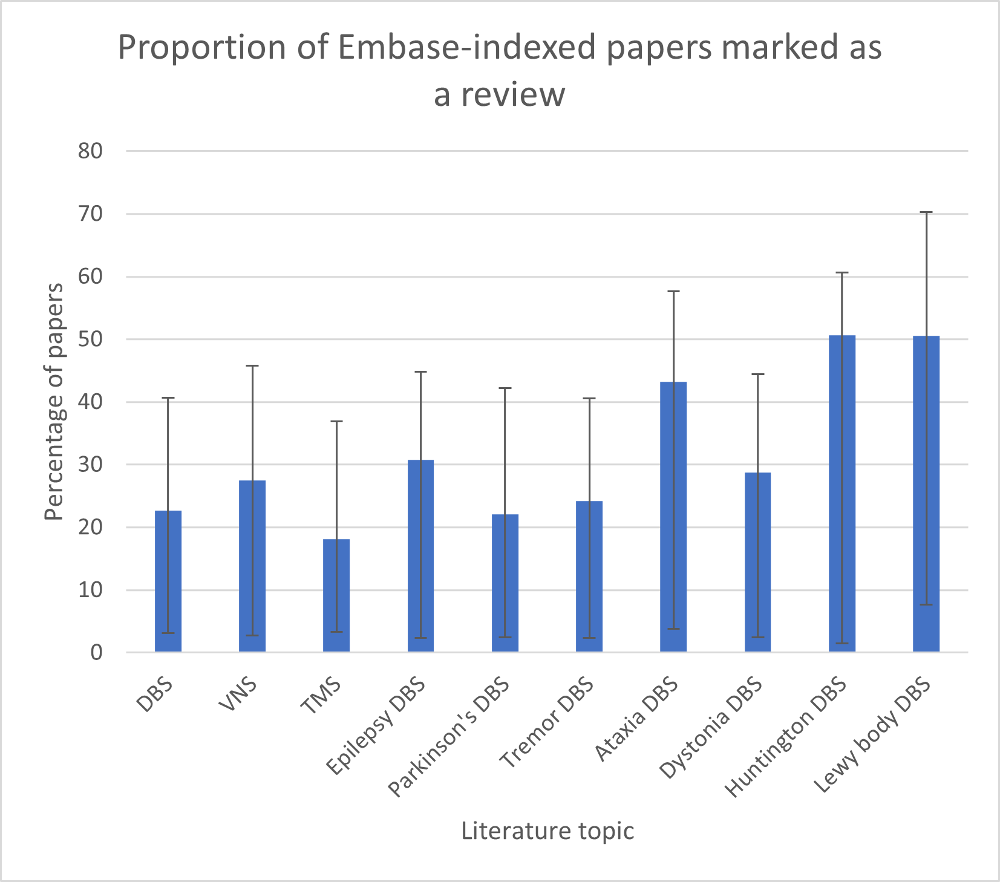
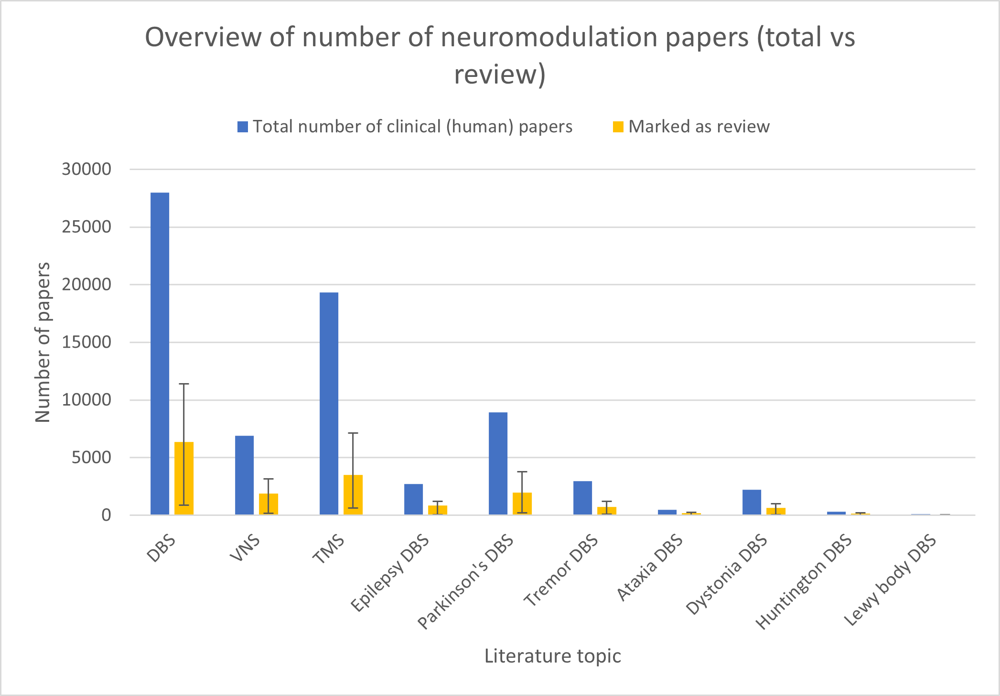
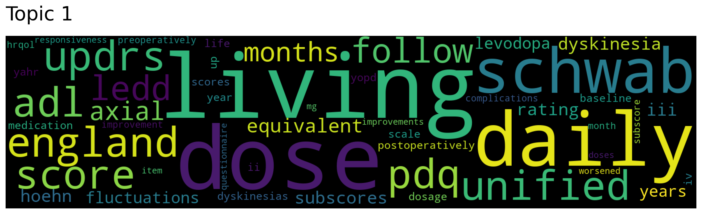
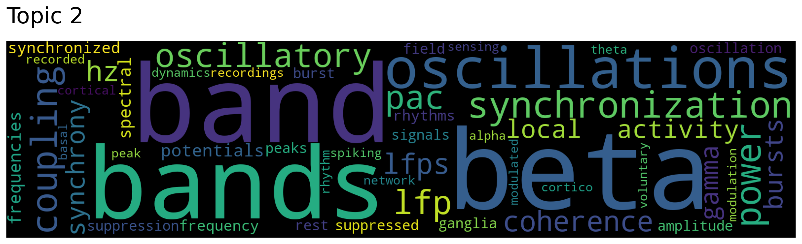
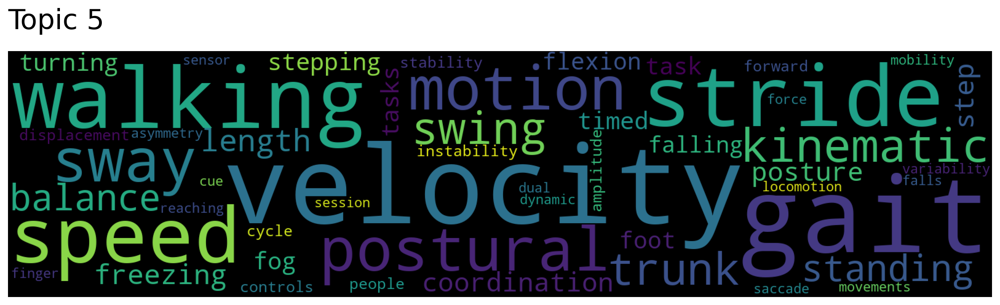
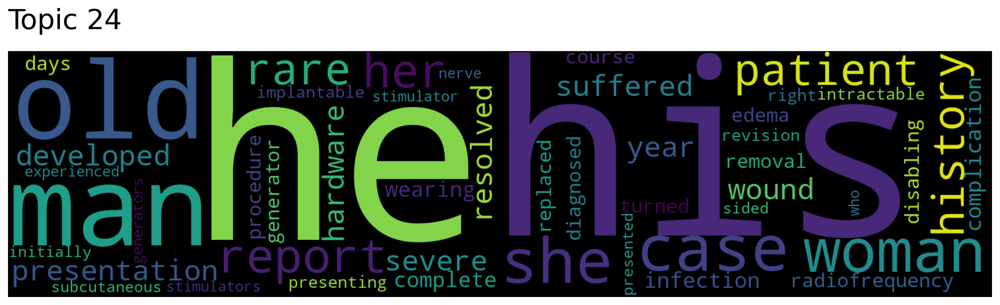
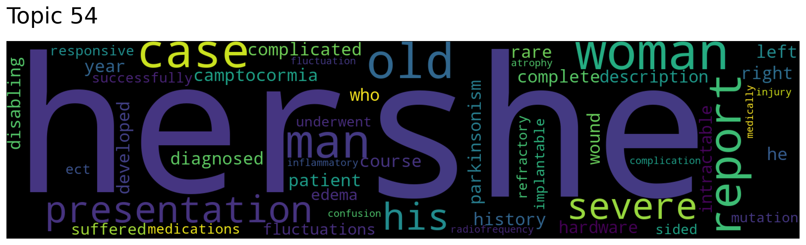
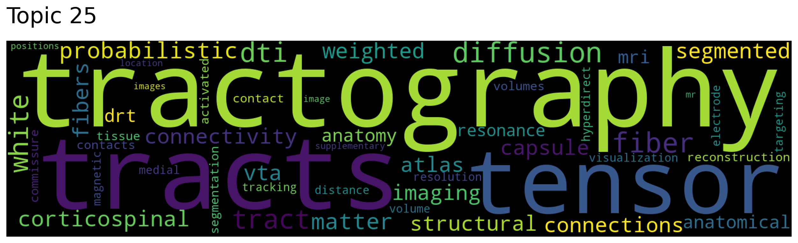
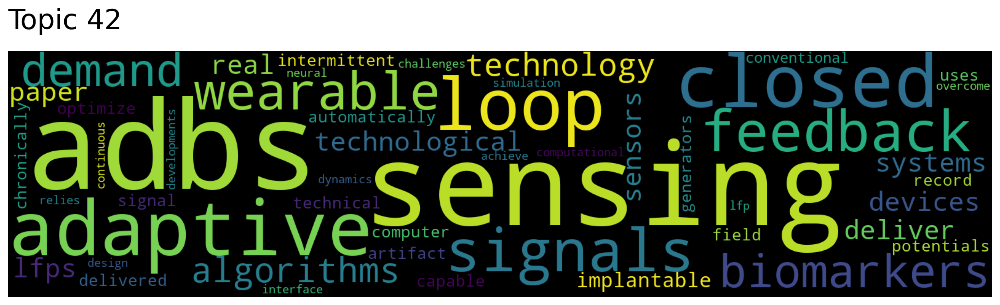
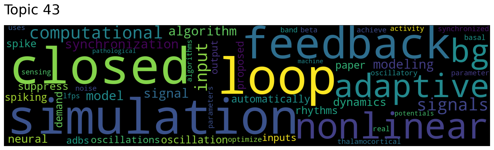

# DBS for obesity and eating disorders
## Methodology
- Search strategy
  - Embase database (1974 - 2023) via Ovid interface
  - Main search for DBS and obesity/eating disorder mapped to their respective terms:
    - "brain depth stimulation/ and (exp obesity/ or exp eating disorder/)"
    - Returns 731 hits
  - Limit main search to human studies 
    - Returns 557 hits
- 557 articles were exported to Covidence for screening and labelling
  - Exported data with labels can be found in [`data\obesity_eating_v1_covidence_annot.csv`](data\obesity_eating_v1_covidence_annot.csv)
- Screening + study labelling strategy
  - Inclusion:
    - Has data/discussion on DBS as a treatment for obesity or eating disorders
    - Review papers with a broader topic that still covers DBS for obesity or eating disorders (e.g., DBS for neuropsychiatric disorders or neuromodulation for obesity)
  - Exclusion:
    - Articles primarily discussing ethics of DBS use
    - Articles that only study non-invasive methods for obesity/eating disorders
    - Articles centered around physiology/anatomy (e.g., using DBS patient data for connectivity mapping)
  - Studies marked as "studies with outcomes data":
    - Non-review, non-case study articles that have data on the treatment efficacy of DBS on obesity or eating disorders in terms of clinical outcome measurements
- Clinicaltrials.gov search terms (terms are automatically mapped to standardized terms)
  - Eating disorders: Eating disorders + Deep brain stimulation
  - Obesity: Obesity + Deep brain stimulation
- 

## Results
| | Total | Number of studies with outcomes data | Number of trials on Clinicaltrials.gov (completed/active) |
| ---- | ---- | ---- | ---- |
| Obesity + eating disorders | 89 | 16 (18.0%) | 6 |
| Eating disorders | 60 | 11 (18.3%) | 2 |
| Obesity | 50 | 5 (10.0%) | 4 |

Notes: 
- 4 of the 11 entries containing outcomes data for eating disorders are follow-up studies so the true number of unique studies may be 7

# Literature covering DBS for movement disorders
## Methodology
- Literature topics were search based only on Embase's pre-indexed Emtree terms (no manual regular expressions were used) hence, these numbers are only approximations 
  - Raw search strategy and results found in [`search_strategies.txt`](search_strategies.txt)
- A paper was labelled as "review" or "non-review" based on "Publication Type" tag via Ovid interface to Embase
  - These tags are supposedly manually index by indexers at the National Library of Medicine (https://ospguides.ovid.com/OSPguides/ovrndb.htm#PT)
- Lower and upper bounds of number of review papers are estimated using Ovid's built in Clinical Queries filter which use regular expression filters to optimize for sensitivity and specificity 
  - Specificity-optimized filter is used to obtain lower bound of number of review papers while sensitivity-optimized filter is used to obtain upper bound
  - [Documentation on search filters](https://hiru.mcmaster.ca/hiru/HiRU_approach.pdf)
  - [Original publication](https://www.ncbi.nlm.nih.gov/pmc/articles/PMC403841/?tool=pubmed)
  - [Embase filters](https://hiru.mcmaster.ca/hiru/HIRU_Hedges_EMBASE_Strategies.aspx)
  - [Medline filters](https://hiru.mcmaster.ca/hiru/HIRU_Hedges_MEDLINE_Strategies.aspx) (not used for this analysis)

## Summary of findings
Topics in neuromodulation don't seem to have a higher proportion of review papers to non-review papers
- In particular for DBS in Parkinson's and tremors, the proportion of review papers seem to be roughly equal to that of the overall DBS literature ~20%
- Smaller literature topics (ataxia, Huntington, Lewy body) seem to have higher proportions of review papers
- Error bars represent the estimated upper and lower bounds obtained via the Clinical Queries filters
- Figure includes literature over entire Embase database (1974-2022)
- 
- 

The proportion of review papers for DBS in general, DBS in Parkinson's, and DBS in tremor does not appear to have changed over the past decade
- Error bars represent the estimated upper and lower bounds obtained via the Clinical Queries filters
- 

# Discovered topic clusters for DBS in Parkinson's
## Summary:
- 81 topics discovered from 7276 abstracts using Top2Vec library
- Analysis and figures generated through https://github.com/EndorphinSponge/NLP_Tools

## Wordclouds for top 3 clusters:
Topic 0 - 396 abstracts

Topic 1 - 324 abstracts

Topic 2 - 307 abstracts

_*Wordclouds for the remaining topics can be found in the `demo/` folder_

## Other interesting topic clusters
Topic 5 (abstracts with a focus on gait symptoms) 196 abstracts

Topic 24 & 54 (case studies) - 104 and 50 abstracts, respectively 

Topic 25 (tractography and connectomics) - 98 abstracts

Topic 42 & 43 (AI driven responsive DBS) - 66 and 65 abstracts, respectively 

